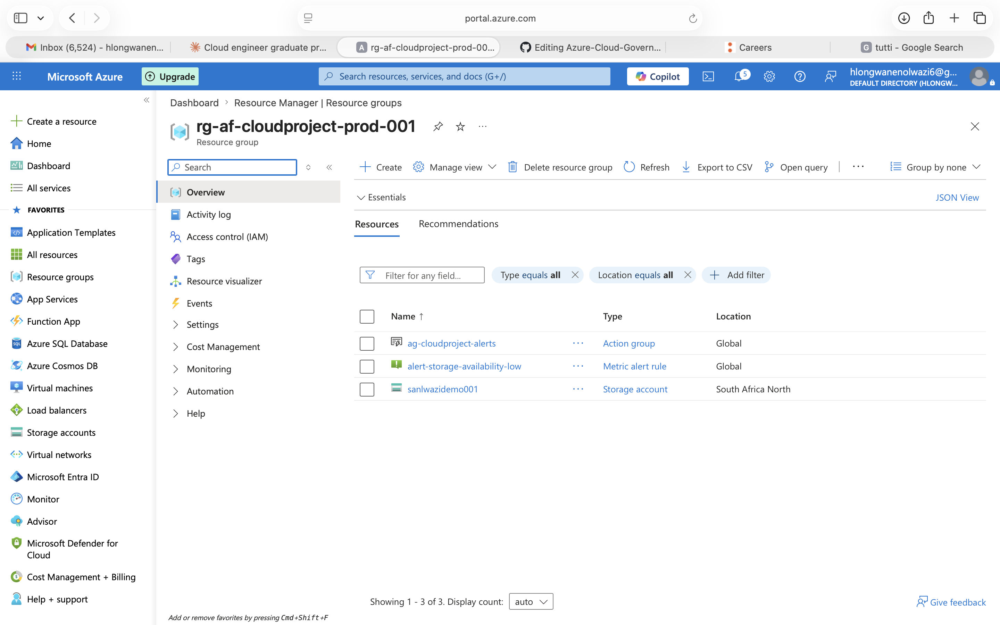
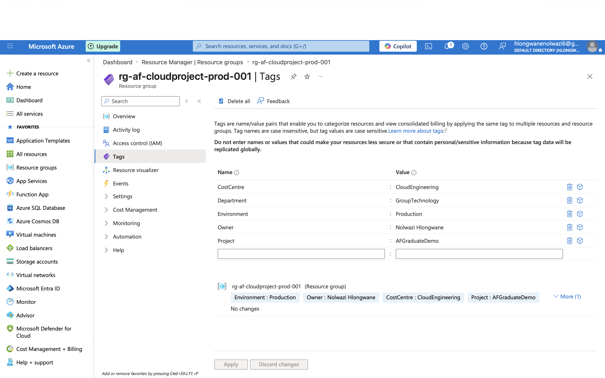
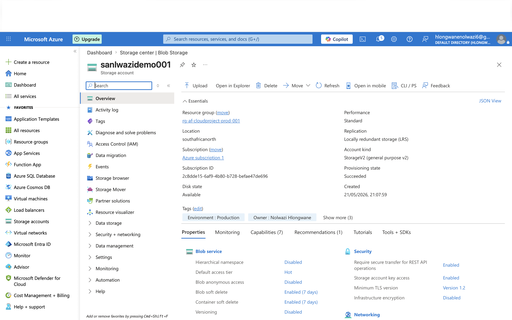
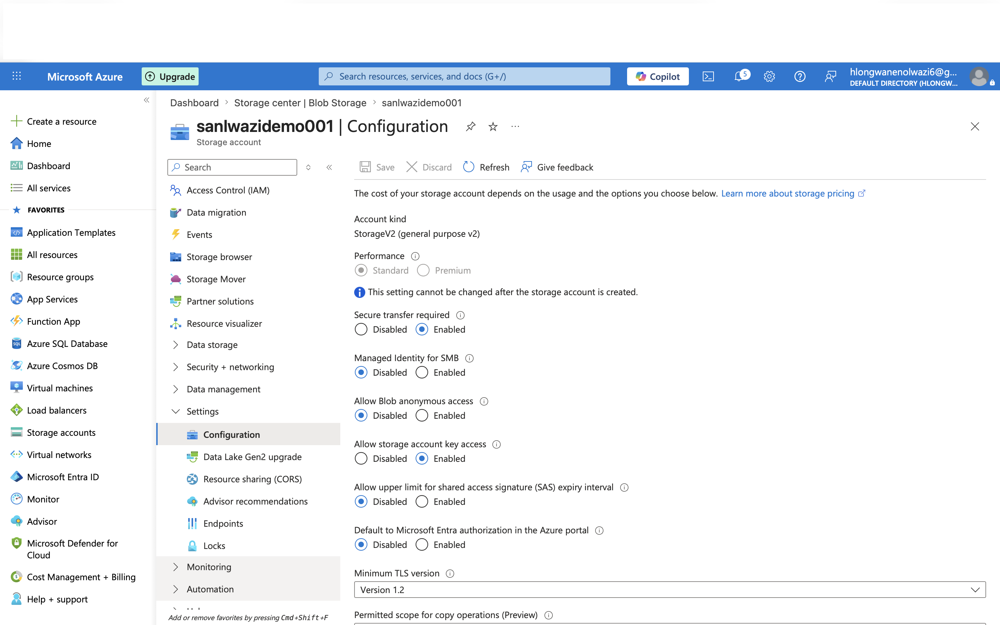
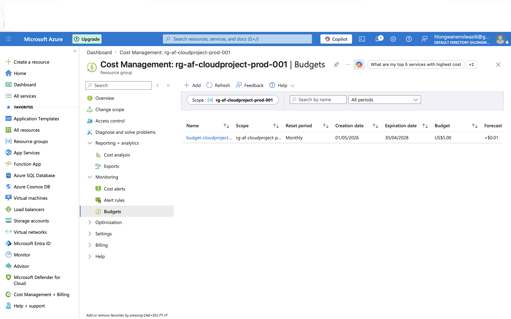
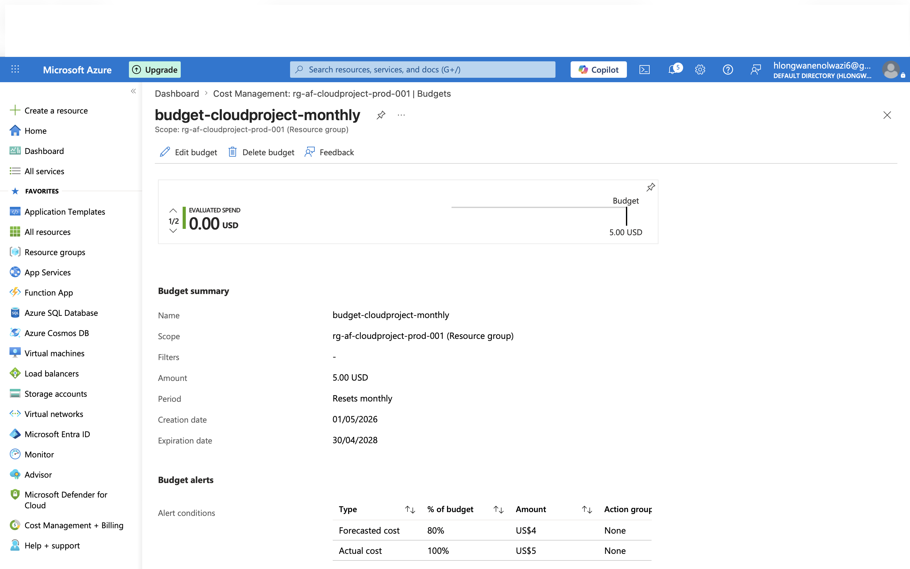
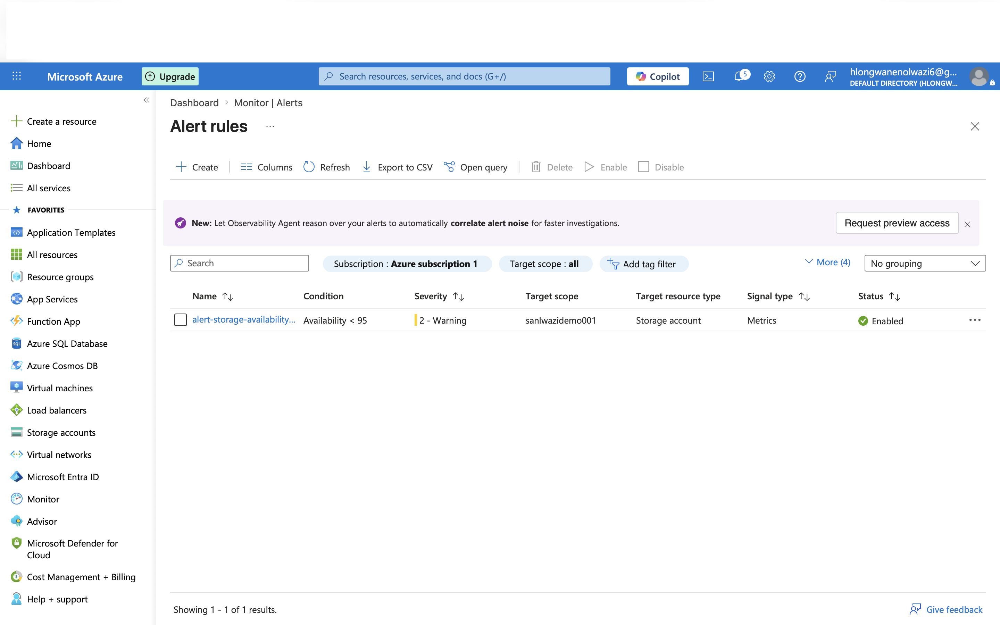
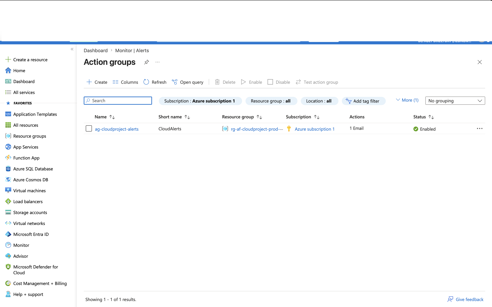
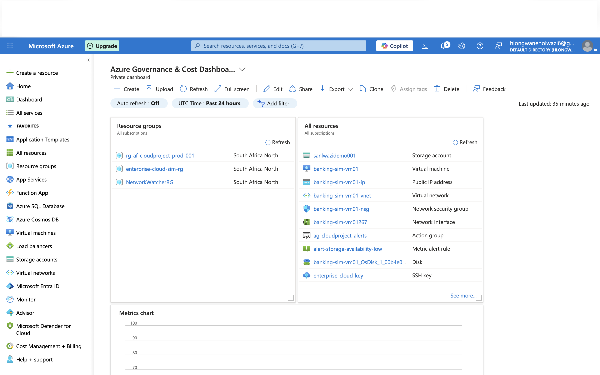
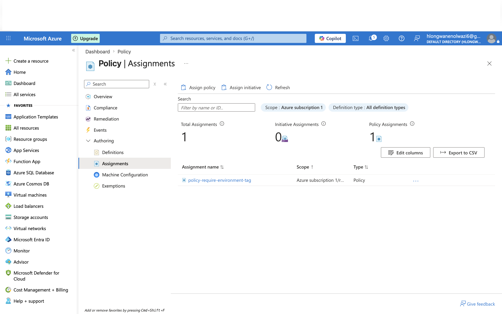

# Azure-Cloud-Governance-Demo
Azure cost management, governance, monitoring and tagging implementation for a cloud infrastructure portfolio project
## Project Overview
This project demonstrates implementation of Azure governance, 
cost management, monitoring, and compliance controls — 
skills relevant to Cloud Engineer roles in enterprise environments.

## Skills Demonstrated
- Azure Resource Group creation with naming conventions
- Resource tagging for governance and cost tracking
- Azure Cost Management: budget and alert configuration
- Azure Monitor: availability alerting
- Azure Policy: tag compliance enforcement
- Azure Dashboard: centralised visibility

## Architecture
- Subscription: Azure Free Tier
- Region: South Africa North
- Resource Group: rg-af-cloudproject-prod-001

## Implementation Steps
## Implementation Steps

### Phase 1 — Azure Account & Resource Group Setup

The first step was signing up for a Microsoft Azure free account and creating a 
dedicated Resource Group to house all project resources. A structured naming 
convention was applied to align with enterprise standards:

**Naming convention used:** `{resource-type}-{project}-{environment}-{number}`

**Resource Group created:** `rg-af-cloudproject-prod-001`
**Region selected:** South Africa North — chosen deliberately to reflect a 
South African enterprise deployment context.

> Resource Groups in Azure are logical containers that hold related resources 
> for a solution. Organising resources into groups makes it easier to manage, 
> monitor, and control costs across a project or department.

---

### Phase 2 — Resource Tagging for Governance

Tags were applied to the Resource Group to simulate an enterprise cost 
governance and ownership tracking structure. In large organisations, every 
Azure resource must carry tags so Finance and IT teams can identify who owns 
it, which department is billed, and what environment it belongs to.

**Tags applied:**

| Tag Name | Value |
|----------|-------|
| Environment | Production |
| Owner | Nolwazi Hlongwane |
| CostCentre | CloudEngineering |
| Project | AFGraduateDemo |
| Department | GroupTechnology |

---

### Phase 3 — Storage Account Deployment with Security Controls

A Storage Account was deployed into the Resource Group with the following 
security configurations enforced at provisioning:

- **Secure transfer required:** Enabled — forces all data in transit to use HTTPS
- **Minimum TLS version:** TLS 1.2 — prevents connections using outdated, 
  insecure encryption protocols
- **Public blob access:** Disabled — prevents anonymous public access to stored data

These settings reflect real compliance requirements in financial services 
environments where data security and regulatory standards (such as POPIA in 
South Africa) must be enforced at the infrastructure level.

The same tags from Phase 2 were applied to the storage account at 
deployment time, ensuring all resources are consistently tagged from creation.

---

### Phase 4 — Cost Budget and Alerts via Azure Cost Management

A monthly cost budget was configured in Azure Cost Management to demonstrate 
proactive spend monitoring. In enterprise cloud environments, unmonitored 
resource costs can escalate rapidly — budgets and alerts are a first line of 
defence for FinOps (Financial Operations) governance.

**Budget configured:**
- **Name:** `budget-cloudproject-monthly`
- **Reset period:** Monthly
- **Alert threshold 1:** 80% of budget → email notification triggered
- **Alert threshold 2:** 100% of budget → email notification triggered

This ensures that responsible stakeholders are notified before costs exceed 
acceptable limits, enabling timely intervention.

---

### Phase 5 — Azure Monitor Availability Alert

An Azure Monitor alert rule was configured on the Storage Account to 
trigger a notification when resource availability drops below 95%. This 
simulates real-world reliability monitoring where cloud engineers are 
expected to be proactively notified of degraded service performance before 
end users are impacted.

**Alert rule configured:**
- **Resource monitored:** Storage Account (`sanlwazidemo001`)
- **Condition:** Availability less than 95%
- **Severity:** 2 — Warning
- **Action:** Email notification via Action Group (`ag-cloudproject-alerts`)

An **Action Group** was created to define who gets notified and how. 
Action Groups can notify via email, SMS, push notifications, or trigger 
automated runbooks — making them a central component of an enterprise 
alerting strategy.

---

### Phase 6 — Azure Dashboard for Centralised Visibility

A custom Azure Dashboard was built to provide a single-pane-of-glass view 
of all deployed resources, their status, and cost information. Dashboards 
are used by Cloud Engineers and operations teams to quickly assess the 
health and state of an environment without navigating through multiple 
portal sections.

**Dashboard tiles included:**
- All resources in the Resource Group
- Resource Group overview
- Cost Management summary

**Dashboard name:** `Azure Governance & Cost Dashboard - Cloud Engineer Demo`

---

### Phase 7 — Azure Policy for Tag Compliance Enforcement

An Azure Policy was assigned to the Resource Group to automatically enforce 
that all newly created resources must carry an `Environment` tag. If a 
resource is deployed without this tag, Azure will block the deployment.

**Policy assigned:** `Require a tag on resources` (built-in Azure policy)
**Tag enforced:** `Environment`
**Scope:** `rg-af-cloudproject-prod-001`

This automates governance enforcement, removing the dependency on manual 
checks and ensuring compliance is maintained even as teams scale and 
resource deployments increase in frequency.

> In enterprise environments, policy-driven governance is critical for 
> maintaining compliance with internal standards and external regulations 
> such as ISO 27001, SOC 2, and sector-specific frameworks like those 
> governing financial services institutions.

## Screenshots

All screenshots are stored in the [`/screenshots`](./screenshots/) folder 
of this repository. They are embedded inline within each Implementation 
Step above for context.

| Screenshot | Description |
|------------|-------------|
| [01_resource_group_created.png](screenshots/01_resource_group_created.png) | Resource Group created in South Africa North |
| [02_tags_applied.png](screenshots/02_tags_applied.png) | Governance tags applied to Resource Group |
| [03_storage_account_overview.png](screenshots/03_storage_account_overview.png) | Storage Account overview and deployment confirmation |
| [04_storage_security_settings.png](screenshots/04_storage_security_settings.png) | Security hardening settings on Storage Account |
| [05_cost-budget_created.png](screenshots/05_cost-budget_created.png) | Monthly cost budget configured |
| [06_budget_alert_conditions.png](screenshots/06_budget_alert_conditions.png) | Budget alert thresholds at 80% and 100% |
| [07_monitor_alert_rule.png](screenshots/07_monitor_alert_rule.png) | Azure Monitor availability alert rule |
| [08_action_group_created.png](screenshots/08_action_group_created.png) | Action Group for alert notifications |
| [09_dashboard_overview.png](screenshots/09_dashboard_overview.png) | Custom Azure governance dashboard |
| [10_policy_assignment.png](screenshots/10_policy_assignment.png) | Azure Policy enforcing tag compliance |

## Certifications In Progress
- Microsoft Azure Fundamentals (AZ-900)
- Cisco Networking Basics (Completed 2025)
